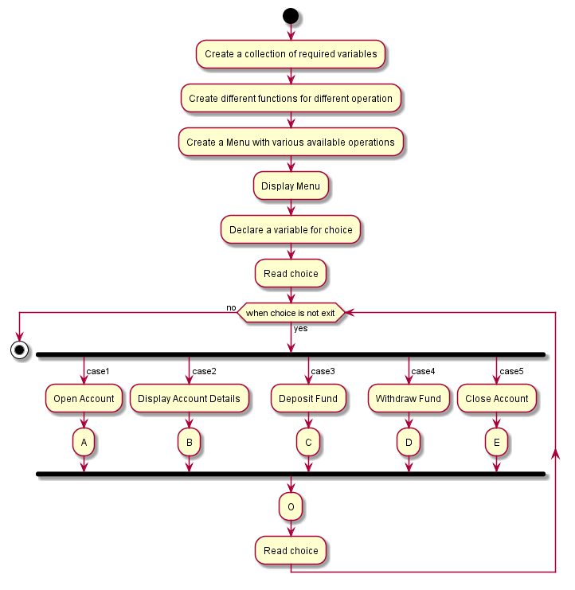
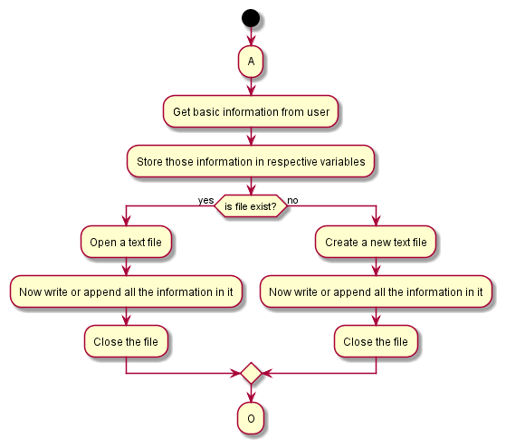
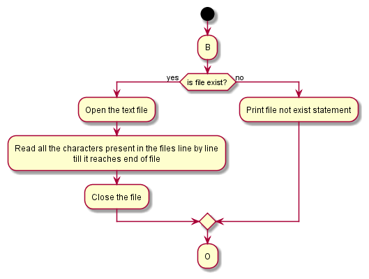
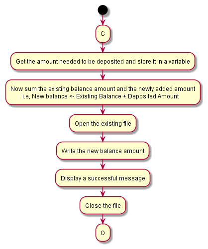
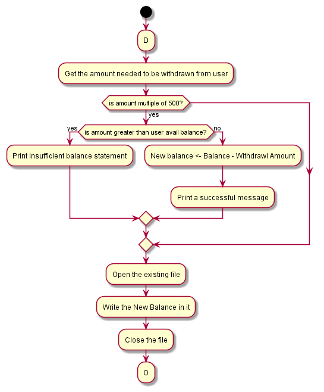
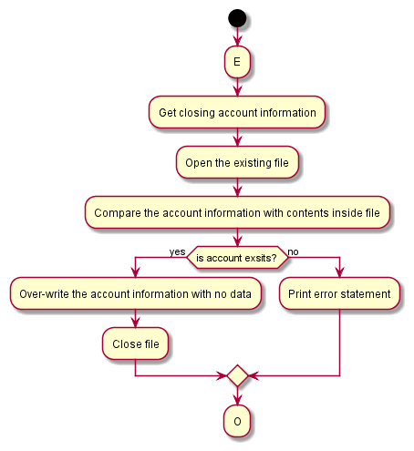

# Banking-System
- Objective:

    To create a menu which performs tasks such as Opening a bank account, closing a bank account and maintaining it.

The repository consists of following directories:

- Assets:

    Assets are flowchart files. We created our flowchart for the task using Plantuml and stored it here.

- Docs:

    It contains various issues we faced while developing Source for the given task. It is useful for future purpose while debugging a same kind of issue.

- Src:

    It contains our task's source. We can pull this source and work with it on any required time.

The following are Flowcharts for the task:

- General Flowchart:

    

- Flowchart for Opening an Account:

    

- Flowchart for Displaying account details:

    

- Flowchart for Depositing Fund:

    

- Flowchart for Withdrawing Fund:

    

- Flowchart for Closing an account:

    

- Version:

    banking_system Version_v1.0.0